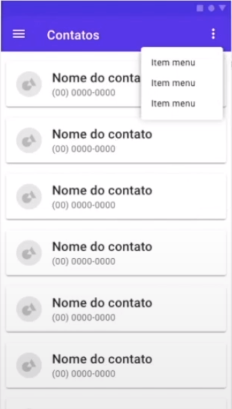
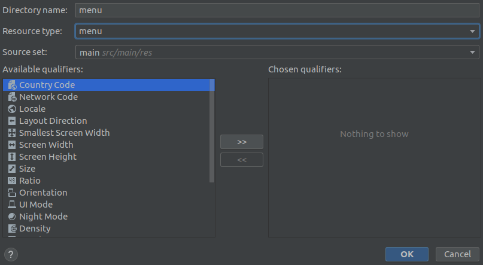

# Options Menus

### Função

* Mostrar funções básica do aplicativo

### Exemplo

### Diretório Android menu

* Responsável por armazenar os menus do app

* **Criar esse diretório**

  * Botão direito no diretório `res`

  * Clicar na opção: `Android Resource Directory`

    