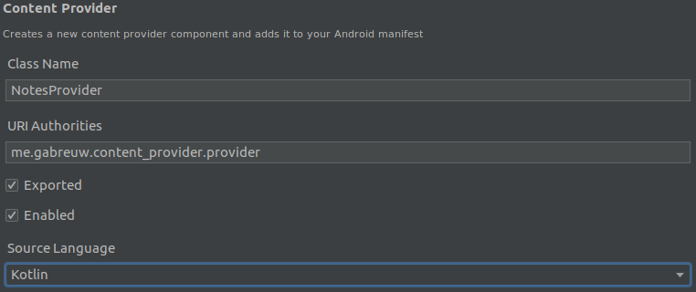

# Content Provider

### Definição

* É um provedor de conteúdo, onde permite compartilhar informações de uma aplicação com outras aplicações

### Vantagens

* Permitir compartilhar dados de forma padronizada

* Para alterar a forma de persistir os dados, é preciso alterar apenas o *provider*

* É o mecanismo padrão de compartilhamento de dados da aplicação com outros componentes do sistema e com outras aplicações que estejam no mesmo dispositivo

### Criar um Content Provider

* Botão direito no pacote da aplicação > `New` > `Other` > `Content Provider`

  

  * **Class Name**: nome da classe do *Content Provider*

  * **URI Authorities**: endereço do *provider* no qual será acessado

    > **FORMATO DO ENDEREÇO**: <pacote da aplicação>.provider 

  * **Exported**: definir se o *provider* poderá ser acessado por outras aplicações

  * **Enabled**: definir se o *provider* poderá ser instanciado pelo sistema

### Funções geradas automaticamente

* `delete`  

  * **Função**: deletar dado(s)

  * **Exemplo**

    ```kotlin
    override fun delete(uri: Uri, selection: String?, selectionArgs: Array<String>?): Int {
        TODO("Implement this to handle requests to delete one or more rows")
    }
    ```

* `getType`

  * **Função**: validar uma URL, por exemplo caminho de arquivo

  * **Exemplo**
    
    ```kotlin
    override fun getType(uri: Uri): String? {
        TODO(
            "Implement this to handle requests for the MIME type of the data" +
                    "at the given URI"
        )
    }
    ```

* `insert`

  * **Função**: inserir dado(s)

  * **Exemplo**

    ```kotlin
    override fun insert(uri: Uri, values: ContentValues?): Uri? {
        TODO("Implement this to handle requests to insert a new row.")
    }
    ```

* `onCreate`

  * **Função**: iniciar um *Content Provider* (instanciação do banco de dados/URLs)

  * **Exemplo**

    ```kotlin
    override fun onCreate(): Boolean {
        TODO("Implement this to initialize your content provider on startup.")
    }
    ```

* `query`

  * **Função**: selecionar dado(s) do banco de dados ou arquivos locais, como um "*SELECT*"

  * **Exemplo**

    ```kotlin
    override fun query(
        uri: Uri, projection: Array<String>?, selection: String?,
        selectionArgs: Array<String>?, sortOrder: String?
    ): Cursor? {
        TODO("Implement this to handle query requests from clients.")
    }
    ```

* `update`

  * **Função**: atualizar IDs do *Content Provider*

  * **Exemplo**

    ```kotlin
    override fun update(
        uri: Uri, values: ContentValues?, selection: String?,
        selectionArgs: Array<String>?
    ): Int {
        TODO("Implement this to handle requests to update one or more rows.")
    }
    ```