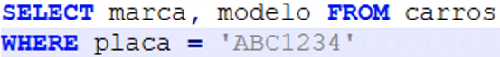
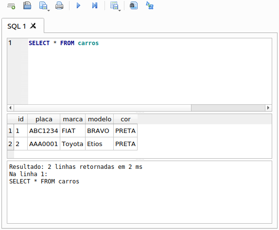
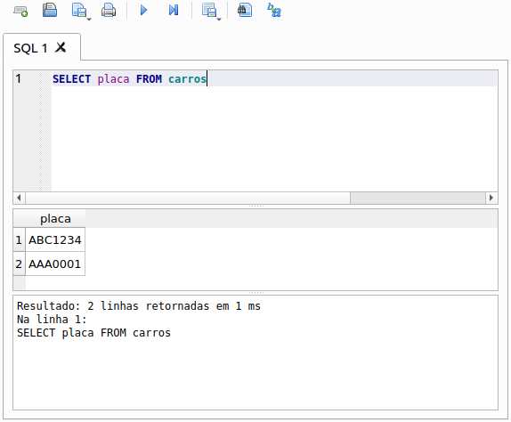
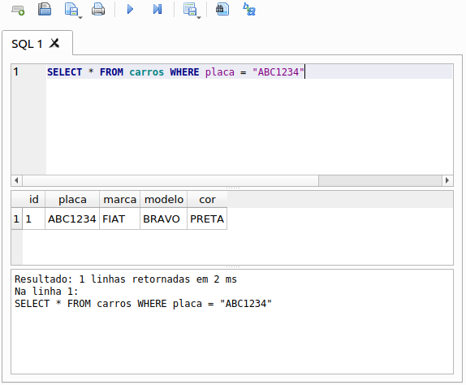
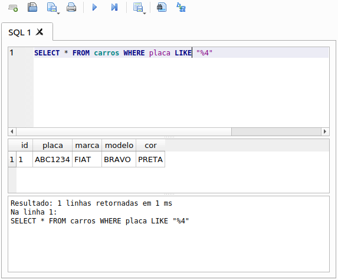
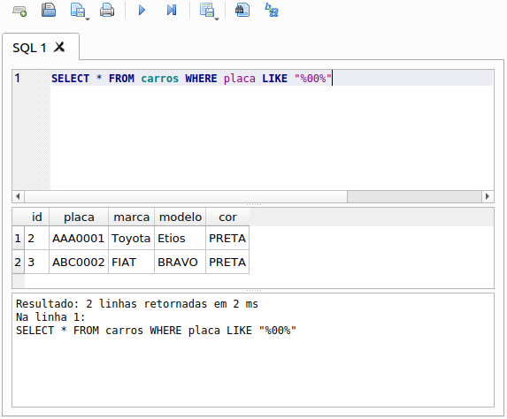

# Buscando dados

### Busca de dados da tabela

* **Estrutura de uma *query* `SELECT`**

  * **Busca por um dado específica**

    ```sql
    SELECT [coluna(s)] FROM [tabela] WHERE [coluna] = [valor]
    ```

  * **Busca por todas os dados de uma coluna(s)**

    ```sql
    SELECT [coluna(s)] FROM [tabela]
    ```

  * **Busca de todo os dados da tabela**

    ```sql
    SELECT * from [tabela]
    ```

* **Exemplo**

  

### Busca de dados com *DB Browser for SQLite*

* Buscar todo o contúdo da tabela

  

* Buscar todos os dados de uma coluna

  

* Buscar por um dado específico

  

* Buscar por dado(s) que possui/possuem um determinado termo

  * **IMPORTANTE**: `%` é utilizando para especificar se o termo a ser pesquisado possui caractéres antes ou depois.

  > Buscar todos os dados que terminal com `4` na placa
  

  > Buscar todos os dados que possuem `00` na placa
  