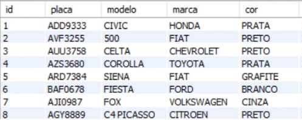
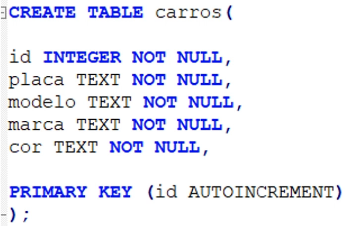
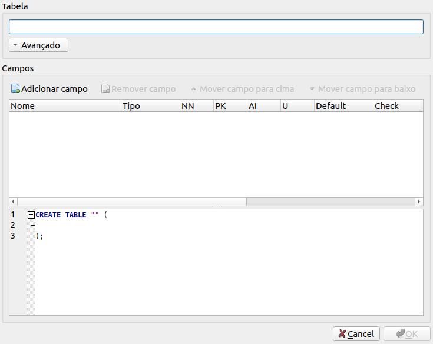
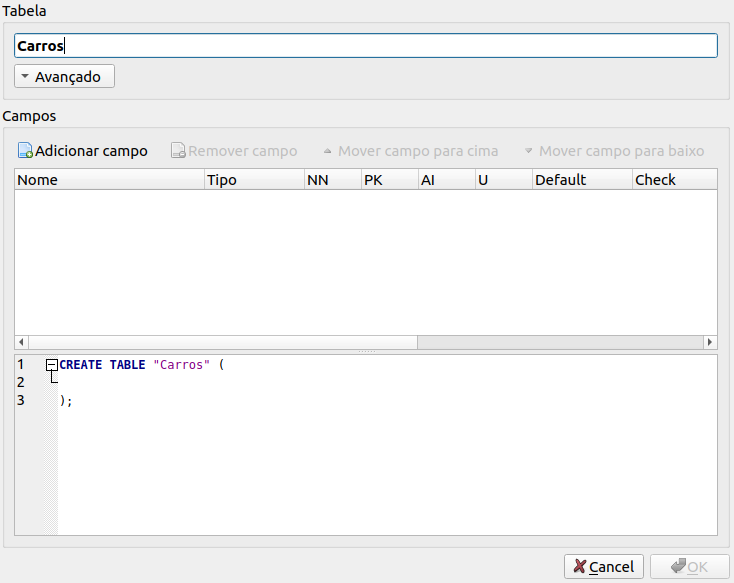
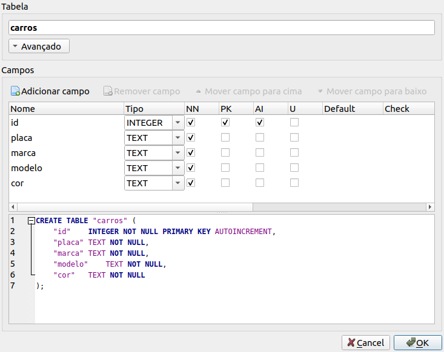

# Criando tabelas

### Tabela

* **Definição**: é uma forma de armazenar dados em um banco de dados

* **Exemplo**

  

* **Query para criar uma tabela**

  * **Sintaxe**

    ```sql
    CREATE TABLE [nome da tabela] (
      # Corpo: definir as colunas e seus parâmetros
      [nome da coluna] [tipo de dado da coluna] [parâmetro(s)]
    );
    ```

    > **OBS**: o `;` no final de cada *query* é opcional, se no arquivo só conter apenas 1 *query*

  * **Exemplo**

    

### Criar tabela com *DB Browser for SQLite* 

* Criar um novo banco de dados: clicar no botão `Novo banco de dados`

* Criar uma nova tabela: clicar no botão `Criar tabela`

* Após clicar nesse botão, será exibido a seguinte tela:

  

* Especificar o nome da tabela

  

* Especificar o(s) campo(s): clicar no botão `Adicionar campo`

  

  * `NN`: NOT NULL

  * `PK`: PRIMARY KEY

  * `AI`: AUTO INCREMENT

* Por fim: clicar em `OK`