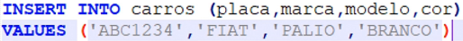
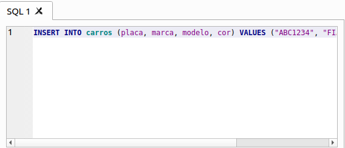
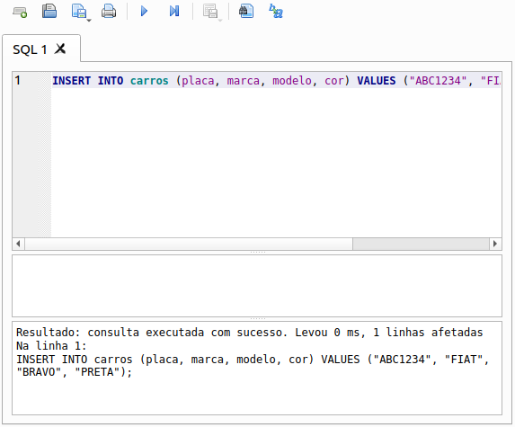
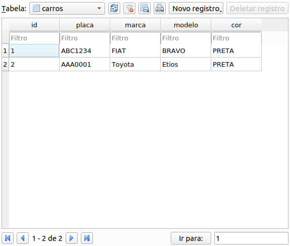

# Inserindo dados

### Inserção de dados na tabela

* **Estrutura de uma *query* `INSERT`**

  ```sql
  INSERT INTO [tabela] [nome da(s) coluna(s)] VALUES [valores]
  ```

  > **IMPORTANTE**: **NÃO** é passado o id, pois é gerado automaticamente pelo banco de dados

* **Exemplo**

  

### Inserção de dados com *DB Browser for SQLite*

* Clicar na aba `Executar SQL`

* Inserir a *query*: `INSERT INTO carros (placa, marca, modelo, cor) VALUES ("ABC1234", "FIAT", "BRAVO", "PRETA");` (EXEMPLO)



* Executar a *query*: botão de *play* ou `CTRL + ENTER`



### Visualizar os dados da tabela com *DB Browser for SQLite*

* Clicar na aba `Navegar dados`

