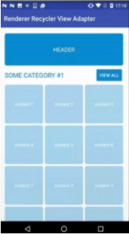
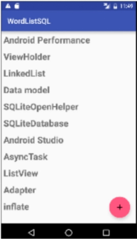

# Introdução a RecyclerView

### Definição

* É uma *ListView*, porém muito mais performática e de fácil implementação

* Os elementos que não estão mais visíveis na tela, por causa da scrolagem do usuário, serão destruídos e aparecerão os novos elementos da lista 

### Tipos de RecyclerView

* **RecyclerView do tipo ListView (linear)**

  

* **RecyclerView do tipo Grid**

  

### Componentes do RecyclerView

* **LayoutManager**: definir o tipo do layout do RecyclerView (grid ou linear)

* **Adapter**: responsável por criar uma *View* para cada item da lista e organizá-la na tela (comunicação entre o *RecyclerView* e a *Activity*)

* **ViewHolder**: faz parte do **Adapter** e armazena as *Views* e seus subcomponentes (*TextView*, *Button*, etc...)

### ListView

* É uma lista, montada dentro de um aplicativo, que ordena os itens dela de forma linear e vertical

### Item e ViewGroup

* Cada um dos elementos da ListView (Android, Java, Php) é um item ou uma *ViewGroup*tem o