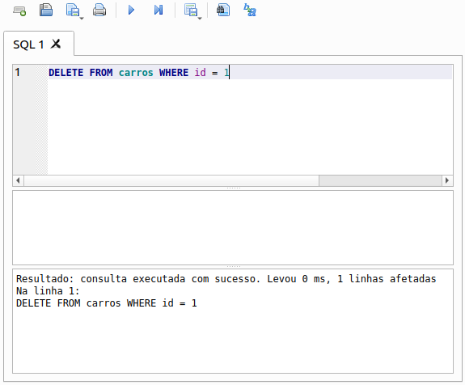

# Removendo dados

### Remoção de dados da tabela

* **Estrutura de uma *query* `DELETE`**

  ```sql
  DELETE FROM [tabela] WHERE [coluna] = [valor]
  ```

  * **CUIDADO**: caso não foi especificado um filtro (`WHERE`), então será excluído toda a tabela

* **Exemplo**

  

### Remoção de dados com *DB Browser for SQLite*

