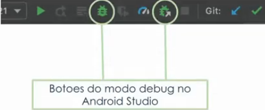

# O que é Debug Build, Breakpoint e Aba Debug

### Ferramentas da IDE (Android Studio)

* ***Build* como *debug***

  

    * **Primeiro botão circulado**: associação entre o build e o debug do app, ou seja, na execução do app, em um emulador ou dispositivo móvel, será feito em modo debug

    * **Segundo botão circulado**: associação entre o debug e um app já em execução (sem a necessidade do *rebuild* do app no modo debug)

  * Para ativar a associação do modo debug no *build* do app é necessário incluir a seguinte configuração no `build.gradle (módulo)`:

    ```gradle
    android {
      buildTypes {
        customDebugType {
          debuggable true
        }
      }
    }
    ```

* *Android Debug Bridge* (ADB) e *Android Debug Bridge plugin* (ADB plugin)

* **Logcat**: consultar os *logs* do app

  > Os *logs* são emitidos e armazenados em um arquivo, independentemente do app estar em modo *debug* ou não 

* **Breakpoints**: 

  * "Ponto de parada" no código (funcionalidade exclusiva do modo *debug*)

  * "Ponto de parada" com condicionais

* **Aba *debug***:

  * Inspeção e alteração de valores de variáveis

  * `Step over`, `step into`, `resume`

  * A aba debug é aberta automaticamente quando um *breakpoint* é acionado

* ***Layout Inspector***: diagnósticos, exclusivamente, de problemas na tela (componentes, *views*, etc)