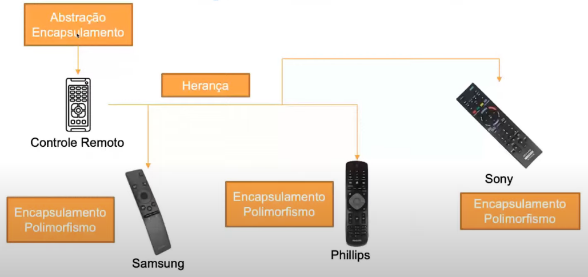

# Praticando orientação a objetos

### Introdução a POO

* É uma técnica / paradigma de como escrever e estrutura o código de um software

* Possibilidade de "componentizar" cada peça do programa a ser desenvolvido

* Em linhas gerais POO está voltada para a nossa realidade

* Sendo assim tudo é objeto aonde objetos são entidades (**Classes**) quem podem ser abstrações e encapsulamentos de toda funcionalidade e características necessárias ao seu uso

* **Pilares da POO**

  * Encapsulamento

  * Abstração

  * Herança 

  * Polimorfismo

  * **Exemplo**

    