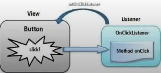

# Interações com a UI

### Outros Layouts Type

* **Absolute Layout**: posição absoluta x e y

* **Table Layout**: formato de tabela

* **Grid Layout**: formato de "grade" (colunas X linhas)

* **Frame Layout**: "moldura", ideal para um único item

### Tratando inputs de texto

* **TextWatchers**

* **Callbacks para o fluxo do input**: Antes do texto mudar / quando o texto muda / após o texto mudar

* **Métodos**

  * `beforeTextChanged(CharSequence s, int start, int count, int before)`

  * `onTextChanged(CharSequence s, int start, int before, int count)`

  * `afterTextChanged(Editable s)`

### Tratando cliques

* Toda View possui um método `onClickLister {}`

* View -> (click do usuário) -> `onClickLister {}`

* Os *listeners* geralmente são declarados no `onCreate`

* Executam uma ação, pegam algum dado e retornam algum feedback visual para o usuário

### Exibindo resultados

* Atribuir valores a compos de texto, botão e etc...

* Exibir um *warning dialog*

* Exibir *toast*

* Abrir uma nova tela
