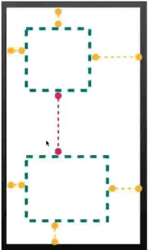
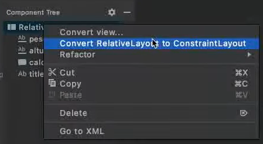

# Layout Types - Constraint Layout

### Constraint Layout

* Baseado em restringir os componentes aos limites do layout ou outros componentes

* Focado em otimização

* Visa substituir o Linear e Relative Layout no desenvolvimento Android

* **Exemplo**

  

### Converter um Relative Layout para um Constraint Layout

* **OBS**: a conversão de Layout pode não sair como o esperado

* `Component Tree` > `Relative Layout` > Botão direito do mouse > `Convert RelativeLayout to ConstraintLayout`

  