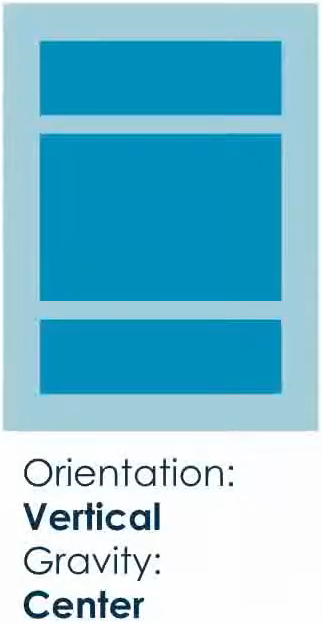
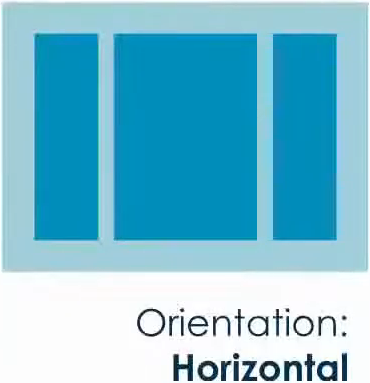

# Layout Types - Linear Layout

### Linear Layout

* Itens alinhados uns após os outros **verticalmente** ou **horizontalmente**

* Elementos não serão sobrepostos

* Orientação dos elementos é feito a partir do atributo `gravity` (gravidade)

* Orientação (vertical ou horizontal) deve ser explicitamente definido

* É possível encadear Linear Layouts, ou seja, colocar um Linear Layout dentro do outro

* **Exemplos**

  

  