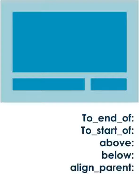

# Layout Types - Relative Layout

### Relativo Layout

* **Características**

  * A posição dos itens é relativa a outros itens ou ao layout "pai"

  * Permite sobreposição de elementos

* **Vantagem**: Elimina a necessidade de layouts encadeados

* **Desvantagem**: exige a criação de hierarquia complexas

* **Exemplo**

  