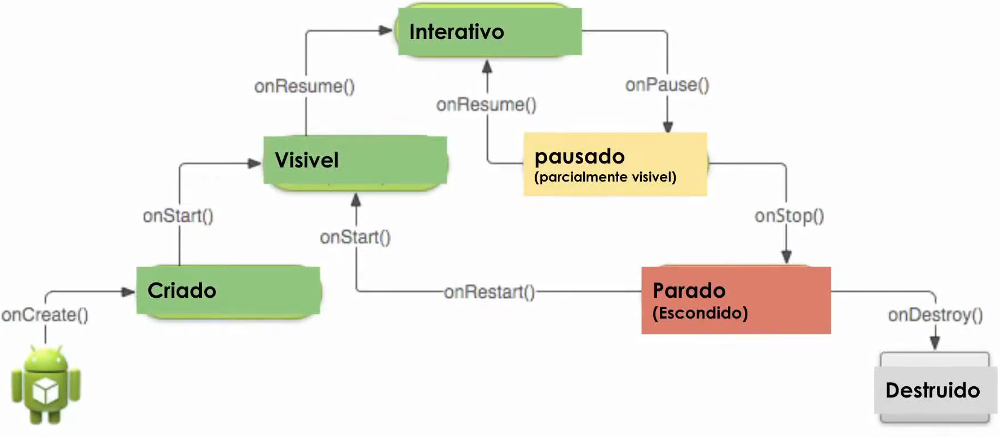

# O ciclo de vida - Teoria

### Ciclo de vida

* **Informa:**
  
  * criação (`OnCreate()` / `OnStart()`)
  * interrupção de uma tela (`onPause()`)
  * retomada de uma tela (`onResume()`)
  * destruição do processo pelo sistema (`onDestroy()`)

* **Ciclo visível VS Ciclo invisível**

  * Ciclo visível: enquanto o usuário está utilizando a aplicação, e portanto possui retorno visual (**aplicação em 1º plano**)

  * Ciclo invisível: quando o usuário não está utilizando a aplicação (**aplicação em 2º plano**)

* Equivalente a várias funções `main()`

* **Representação**

  > verde = ciclo visível | vermelho e amarelo = ciclo invisível
  

  * Começa no `onCreate()`

  * Fim no `onDestroy()`