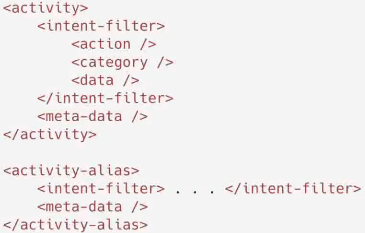
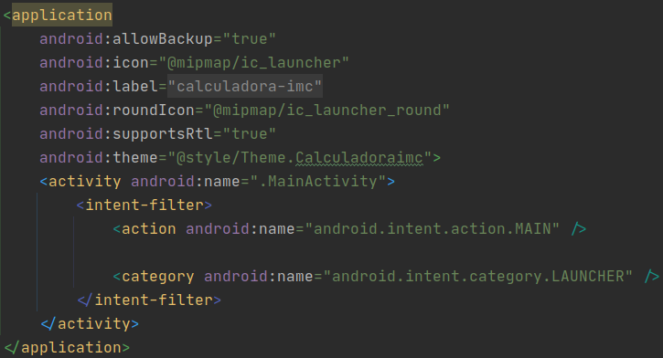

# Visão geral do projeto e exemplo de tags

### Exemplo de TAGs




### Manifest



* `application > activity > intent-filter > category`

  * Quando o `category` for igual a `android.intent.category.LAUNCHER`, então essa activity será a "Home page" do aplicativo

### MainActivity

```kotlin
class MainActivity : AppCompatActivity() {
    override fun onCreate(savedInstanceState: Bundle?) {
        super.onCreate(savedInstanceState)
        setContentView(R.layout.activity_main)
    }
}
```

* a Função `onCreate` é responsável pela criação da tela da aplicação