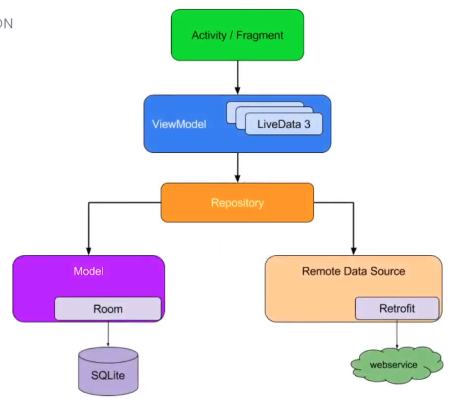

# Conceitos básicos do padrão de arquitetura

### ViewModel

* **Definição**: é uma classe que armazena e gerencia dados da UI

* **ViewModel e Activity**

  * **ViewModel**: regras de negócio da aplicação

  * **Activity**: interface do usuário (UI)

* **Estrutura**

  
